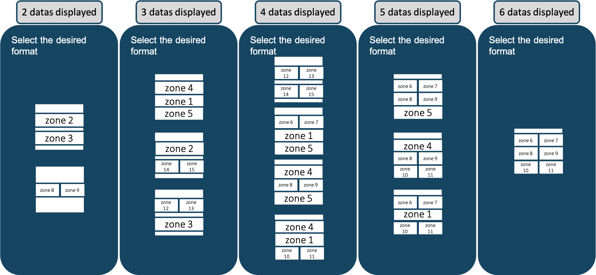

# Activelook Visual Assets

List of the visual objects (images, layouts) available in the default ActiveLook "configuration"

Configuration name : `ALooK`

Configuration version : `5`

Firmware compatible : `4.X.X`

To use the activelook visual asset, use the command : `cfgSet("ALooK")`

## Fonts

* Font 1 : `Computer Modern sans serif 24px`
  * available ASCII table char : `Space` to `~`
* Font 2 : `Computer Modern sans serif 35px`
  * available ASCII table char : `Space` to `~`
* Font 3 : `Computer Modern sans serif 49px`
  * available ASCII table char : `Space` to `~`
* Font 4 : `Computer Modern sans serif 62px`
  * available ASCII table char : `Space` to `;`
  
## Images

| ID | Name                       | Icon                                                                   |
|----|----------------------------|-----------------------------------------------------|
| 0  | `0_Battery_Icon30x15`      |     |
| 1  | `1_Elapsed_Time46x46`      |       |
| 2  | `2_Speed46x46`             |              |
| 3  | `3_Speed_Avg46x46`         |          |
| 4  | `4_Distance46x46`          |           |
| 5  | `5_Elevation_Gain46x46`    |     |
| 6  | `6_Pace46x46`              |               |
| 7  | `7_Heart_Beat46x46`        |         |
| 8  | `8_Altitude46x46`          |           |
| 9  | `9_Cadence_Avg46x46`       |        |
| 10 | `10_Heart_Beat_Avg46x46`   |    |
| 11 | `11_Power_Avg46x46`        |         |
| 12 | `12_Calories46x46`         |          |
| 13 | `13_Cadence46x46`          |           |
| 14 | `14_Power46x46`            |             |
| 15 | `15_Total_Descent46x46`    |     |
| 16 | `16_Energy_Exp46x46`       |        |
| 17 | `17_Ascent_Speed_Avg46x46` |  |
| 18 | `18_Cadence_Max46x46`      |       |
| 19 | `19_Heart_Beat_Max46x46`   |    |
| 20 | `20_Power_Max46x46`        |         |
| 21 | `21_Speed_Max46x46`        |         |
| 22 | `22_Ambient_Pressure46x46` |  |
| 23 | `23_Speed30x30`            |             |
| 24 | `24_Speed_Avg30x30`        |         |
| 25 | `25_Distance30x30`         |          |
| 26 | `26_Elevation_Gain30x30`   |    |
| 27 | `27_Pace30x30`             |              |
| 28 | `28_Heart_Beat30x30`       |        |
| 29 | `29_Altitude30x30`         |          |
| 30 | `30_Cadence_Avg30x30`      |       |
| 31 | `31_Heart_Beat_Avg30x30`   |    |
| 32 | `32_Power_Avg30x30`        |         |
| 33 | `33_Calories30x30`         |          |
| 34 | `34_Cadence30x30`          |           |
| 35 | `35_Power30x30`            |             |
| 36 | `36_Total_Descent30x30`    |     |
| 37 | `37_Energy_Exp30x30`       |        |
| 38 | `38_Ascent_Speed_Avg30x30` |  |
| 39 | `39_Cadence_Max30x30`      |       |
| 40 | `40_Heart_Beat_Max30x30`   |    |
| 41 | `41_Power_Max30x30`        |         |
| 42 | `42_Speed_Max30x30`        |         |
| 43 | `43_Ambient_Pressure30x30` |  |
| 44 | `44_Power_3S_Avg46x46`     |      |
| 45 | `45_Power_3S_Avg30x30`     |      |
| 46 | `46_Pace_Avg46x46`         |          |
| 47 | `47_Pace_Avg30x30`         |          |
| 48 | `48_Norm_Power46x46.bmp`   |        |
| 49 | `49_Norm_Power30x30.bmp`   |        |
| 50 | `50_Low_GPS15x20.bmp`      |           |
| 51 | `51_No_GPS15x20.bmp`       |            |
| 52 | `52_Pause15x20.bmp`        |             |
| 53 | `bord`                     |                      |
| 54 | `connection_lost_logo`          |           |
| 55 | `please_connect_logo`           |            |
| 56 | `user-connect`             |              |
| 57 | `connection_lost_txt`           |            |
| 58 | `please_connect_txt`          |           |
| 239| `239_Bluetooth`            |             |
| 240| `240_Start`                |                 |

## Layouts

| ID | Name                         | x0  | y0  | width | height | font | txtX0 | txtY0 | txtRot | txtOpacity | usetxt |
|----|------------------------------|-----|-----|-------|--------|------|-------|-------|--------|------------|--------|
| 0  | boot                         | 0   | 0   | 303   | 255    | 2    | 0     | 0     | 4      | true       | false  |
| 2  | pleaseconnect                | 30  | 25  | 244   | 206    | 1    | 202   | 50    | 4      | true       | true   |
| 3  | connected                    | 30  | 25  | 244   | 206    | 3    | 255   | 80    | 4      | true       | false  |
| 4  | connectionlost               | 30  | 25  | 244   | 206    | 2    | 280   | 105   | 4      | true       | false  |
| 5  | byebye                       | 30  | 25  | 244   | 206    | 2    | 255   | 80    | 4      | true       | false  |
| 6  | ready                        | 30  | 25  | 244   | 206    | 2    | 255   | 80    | 4      | true       | false  |
| 7  | battery                      | 152 | 200 | 122   | 30     | 1    | 78    | 29    | 4      | true       | true   |
| 9  | suota                        | 0   | 0   | 303   | 255    | 2    | 255   | 80    | 4      | true       | false  |
| 10 | time                         | 30  | 205 | 121   | 25     | 1    | 86    | 22    | 4      | true       | true   |
| 11 | chrono_full                  | 30  | 85  | 244   | 60     | 3    | 170   | 49    | 4      | true       | true   |
| 12 | distance_metric_full         | 30  | 85  | 244   | 60     | 3    | 165   | 49    | 4      | true       | true   |
| 13 | speed_metric_full            | 30  | 85  | 244   | 60     | 3    | 165   | 49    | 4      | true       | true   |
| 14 | speed_avg_metric_full        | 30  | 85  | 244   | 60     | 3    | 165   | 49    | 4      | true       | true   |
| 15 | pace_metric_full             | 30  | 85  | 244   | 60     | 3    | 165   | 49    | 4      | true       | true   |
| 16 | cadence_full                 | 30  | 85  | 244   | 60     | 3    | 165   | 49    | 4      | true       | true   |
| 17 | calories_full                | 30  | 85  | 244   | 60     | 3    | 165   | 49    | 4      | true       | true   |
| 18 | altitude_metric_full         | 30  | 85  | 244   | 60     | 3    | 165   | 49    | 4      | true       | true   |
| 19 | elevation_metric_full        | 30  | 85  | 244   | 60     | 3    | 165   | 49    | 4      | true       | true   |
| 20 | ascent_Speed_Avg_metric_full | 30  | 85  | 244   | 60     | 3    | 165   | 49    | 4      | true       | true   |
| 21 | heartbeat_full               | 30  | 85  | 244   | 60     | 3    | 165   | 49    | 4      | true       | true   |
| 22 | power_full                   | 30  | 85  | 244   | 60     | 3    | 165   | 49    | 4      | true       | true   |
| 23 | cadence_avg_metric_full      | 30  | 85  | 244   | 60     | 3    | 165   | 49    | 4      | true       | true   |
| 24 | heartbeat_full               | 30  | 85  | 244   | 60     | 3    | 165   | 49    | 4      | true       | true   |
| 25 | power_avg_full               | 30  | 85  | 244   | 60     | 3    | 165   | 49    | 4      | true       | true   |
| 26 | Total_Descent_metric_full    | 30  | 85  | 244   | 60     | 3    | 165   | 49    | 4      | true       | true   |
| 27 | energy_Exp_full              | 30  | 85  | 244   | 60     | 3    | 165   | 49    | 4      | true       | true   |
| 28 | cadence_Max_full             | 30  | 85  | 244   | 60     | 3    | 165   | 49    | 4      | true       | true   |
| 29 | heart_Beat_Max_full          | 30  | 85  | 244   | 60     | 3    | 165   | 49    | 4      | true       | true   |
| 30 | power_Max_full               | 30  | 85  | 244   | 60     | 3    | 165   | 49    | 4      | true       | true   |
| 31 | speed_Max_metric_full        | 30  | 85  | 244   | 60     | 3    | 165   | 49    | 4      | true       | true   |
| 32 | ambient_Pressure_full        | 30  | 85  | 244   | 60     | 3    | 165   | 49    | 4      | true       | true   |
| 33 | speed_imp_full               | 30  | 85  | 244   | 60     | 3    | 165   | 49    | 4      | true       | true   |
| 34 | speed_Average_imp_full       | 30  | 85  | 244   | 60     | 3    | 165   | 49    | 4      | true       | true   |
| 35 | distance_imp_full            | 30  | 85  | 244   | 60     | 3    | 165   | 49    | 4      | true       | true   |
| 36 | elevation_imp_full           | 30  | 85  | 244   | 60     | 3    | 165   | 49    | 4      | true       | true   |
| 37 | pace_imp_full                | 30  | 85  | 244   | 60     | 3    | 165   | 49    | 4      | true       | true   |
| 38 | altitude_imp_full            | 30  | 85  | 244   | 60     | 3    | 165   | 49    | 4      | true       | true   |
| 39 | total_Descent_imp_full       | 30  | 85  | 244   | 60     | 3    | 165   | 49    | 4      | true       | true   |
| 40 | ascent_Speed_Avg_imp_full    | 30  | 85  | 244   | 60     | 3    | 165   | 49    | 4      | true       | true   |
| 41 | speed_Max_imp_full           | 30  | 85  | 244   | 60     | 3    | 165   | 49    | 4      | true       | true   |
| 42 | power3s_Avg_full             | 30  | 85  | 244   | 60     | 3    | 165   | 49    | 4      | true       | true   |
| 43 | Chrono_half                  | 152 | 145 | 122   | 60     | 3    | 113   | 52    | 4      | true       | true   |
| 44 | Speed_half                   | 152 | 145 | 122   | 60     | 3    | 87    | 52    | 4      | true       | true   |
| 45 | Speed_Average_half           | 152 | 145 | 122   | 60     | 3    | 87    | 52    | 4      | true       | true   |
| 46 | Distance_half                | 152 | 145 | 122   | 60     | 3    | 87    | 52    | 4      | true       | true   |
| 47 | Elevation_Gain_half          | 152 | 145 | 122   | 60     | 3    | 87    | 52    | 4      | true       | true   |
| 48 | Pace_half                    | 152 | 145 | 122   | 60     | 3    | 87    | 52    | 4      | true       | true   |
| 49 | HeartBeat_half               | 152 | 145 | 122   | 60     | 3    | 87    | 52    | 4      | true       | true   |
| 50 | Altitude_half                | 152 | 145 | 122   | 60     | 3    | 87    | 52    | 4      | true       | true   |
| 51 | Cadence_AVG_half             | 152 | 145 | 122   | 60     | 3    | 87    | 52    | 4      | true       | true   |
| 52 | Heart_Beat_AVG_half          | 152 | 145 | 122   | 60     | 3    | 87    | 52    | 4      | true       | true   |
| 53 | Power_AVG_half               | 152 | 145 | 122   | 60     | 3    | 87    | 52    | 4      | true       | true   |
| 54 | Calories_half                | 152 | 145 | 122   | 60     | 3    | 87    | 52    | 4      | true       | true   |
| 55 | Cadence_half                 | 152 | 145 | 122   | 60     | 3    | 87    | 52    | 4      | true       | true   |
| 56 | Power_half                   | 152 | 145 | 122   | 60     | 3    | 87    | 52    | 4      | true       | true   |
| 57 | Total_Descent_half           | 152 | 145 | 122   | 60     | 3    | 87    | 52    | 4      | true       | true   |
| 58 | Energy_Exp_half              | 152 | 145 | 122   | 60     | 3    | 87    | 52    | 4      | true       | true   |
| 59 | Ascent_Speed_Avg_half        | 152 | 145 | 122   | 60     | 3    | 87    | 52    | 4      | true       | true   |
| 60 | Cadence_Max_half             | 152 | 145 | 122   | 60     | 3    | 87    | 52    | 4      | true       | true   |
| 61 | Heart_Beat_Max_half          | 152 | 145 | 122   | 60     | 3    | 87    | 52    | 4      | true       | true   |
| 62 | Power_Max_half               | 152 | 145 | 122   | 60     | 3    | 87    | 52    | 4      | true       | true   |
| 63 | Speed_Max_half               | 152 | 145 | 122   | 60     | 3    | 87    | 52    | 4      | true       | true   |
| 64 | Ambient_Pressure_half        | 152 | 145 | 122   | 60     | 3    | 87    | 52    | 4      | true       | true   |
| 65 | Power3s_Avg_half             | 152 | 145 | 122   | 60     | 3    | 87    | 52    | 4      | true       | true   |
| 66 | pace_Avg_metric_full         | 30  | 85  | 244   | 60     | 3    | 165   | 49    | 4      | true       | true   |
| 67 | pace_Avg_imp_full            | 30  | 85  | 244   | 60     | 3    | 165   | 49    | 4      | true       | true   |
| 68 | Pace_Avg_half                | 152 | 145 | 122   | 60     | 3    | 87    | 52    | 4      | true       | true   |
| 69 | power_norm_full              | 30  | 85  | 244   | 60     | 3    | 165   | 49    | 4      | true       | true   |
| 70 | Power normalised_half        | 152 | 145 | 122   | 60     | 3    | 87    | 52    | 4      | true       | true   |
| 71 | gps                          | 121 | 205 | 20    | 25     | 1    | 86    | 22    | 4      | true       | false  |
| 72 | no gps                       | 121 | 205 | 20    | 25     | 1    | 86    | 22    | 4      | true       | false  |
| 73 | pause                        | 121 | 205 | 20    | 25     | 1    | 86    | 22    | 4      | true       | false  |
| 74 | Power normalised_half        | 152 | 145 | 122   | 60     | 3    | 87    | 52    | 4      | true       | true   |

## Layout position

For example purposes, you will find below the layout positions that are used in the ActiveLook companion application. It provides a reference developers can re-use for their own application or for rapid prototyping, instead of designing custom layouts.

|zone|position|X|Y|
|--|--------|-|-|
|1|Full 1/3L Middle|30|85|
|2|Full 2L Top|30|125|
|3|Full 2L Bottom|30|45|
|4|Full 3L Top|30|145|
|5|Full 3L Bottom|30|25|
|6|Half 3L Top Left|152|145|
|7|Half 3L Top Right|30|145|
|8|Half 3L Middle Left|152|85|
|9|Half 3L Middle Right|30|85|
|10|Half 3L Bottom Left|152|25|
|11|Half 3L Bottom Right|30|25|
|12|Half 2L Top Left|152|125|
|13|Half 2L Top Right|30|125|
|14|Half 2L Bottom Left|152|45|
|15|Half 2L Bottom Right|30|45|
