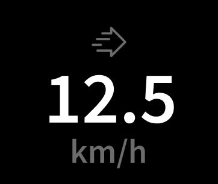
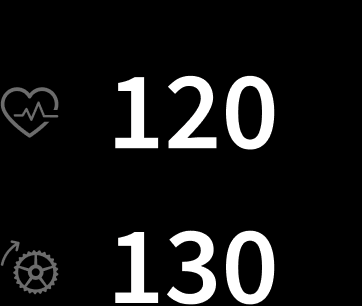
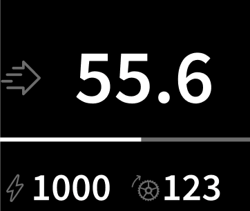
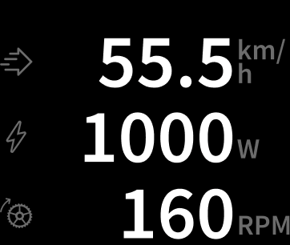
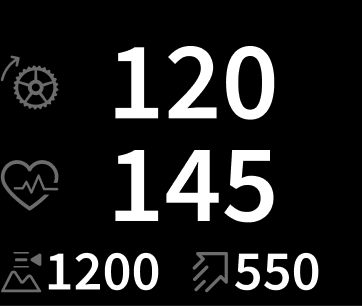
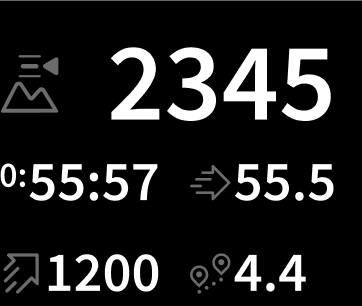
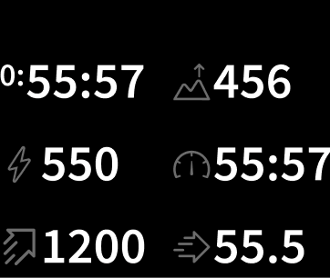

# Activelook Visual Assets

List of the visual objects (images, layouts) available in the default ActiveLook "configuration"

Configuration name : `ALooK`

Configuration version : `11`

Firmware compatible : `>= 4.2.X`

To use the activelook visual asset, use the command : `cfgSet("ALooK")`

## Fonts

* Font 1 : `SourceSansPro SemiBold Spacing 24px`
  * available ASCII table char : `Space` to `~`
  * with two ghost letters :
    * `$` corresponding to `0`
    * `&` corresponding to `:`
* Font 2 : `SourceSansPro SemiBold Spacing 38px`
  * available ASCII table char : `Space` to `~`
  * with two ghost letters :
    * `$` corresponding to `0`
    * `&` corresponding to `:`
* Font 3 : `SourceSansPro SemiBold Spacing 64px`
  * available ASCII table char : `Space` to `~`
  * with two ghost letters :
    * `$` corresponding to `0`
    * `&` corresponding to `:`
* Font 3 : `SourceSansPro SemiBold Spacing 75px`
  * available ASCII table char : `Space` to `;`
  * with two ghost letters :
    * `$` corresponding to `0`
    * `&` corresponding to `:`
* Font 3 : `SourceSansPro SemiBold Spacing 82px`
  * available ASCII table char : `Space` to `;`
  * with two ghost letters :
    * `$` corresponding to `0`
    * `&` corresponding to `:`

## Animation

| ID  | Name                       | Icon                                                 |
|-----|----------------------------|------------------------------------------------------|
| 0   | `0_splash_10fps`           |              |
| 2   | `2_dancing_dots_x_98_y_112_loop` |  |
| 3   | `3_ready_x_77_y_112_loop`  |     |
| 4   | `4_successfull_x_76_y_112` |    |
| 5   | `5_bluetooth-lost_x_107_y_187_loop` |  |
| 6   | `6_countdown_x_76_y_56`    |       |
| 7   | `7_overlay_lowbattery_x_98_y_91` |  |
| 8   | `8_overlay_eyesClosed_x_40_y_63` |  |
| 9   | `9_overlay_pause_x_68_y_42` |   |
| 10  | `10_overlay_targetReached_1_x_73_y_92` |  |
| 11  | `11_overlay_sessionEnded_x_85_y_88` |  |
| 12  | `12_overlay_targetReached_2_x_85_y_91_loop` |  |
| 13  | `13_outro_fullscreen`      |         |

## Images

| ID  | Name                       | Icon                                                 |
|-----|----------------------------|------------------------------------------------------|
| 0   | `0_battery_28x28`          |           |
| 1   | `1_battery-low_28x28`      |       |
| 2   | `2_altitude_28x28`         |          |
| 3   | `3_ambient-pressure_28x28` |  |
| 4   | `4_cadence_28x28`          |           |
| 5   | `5_cadence-avg_28x28`      |       |
| 6   | `6_cadence-max_28x28`      |       |
| 7   | `7_calories-burned_28x28`  |   |
| 8   | `8_chrono_28x28`           |            |
| 9   | `9_distance_28x28`         |          |
| 10  | `10_distance-to-destination_28x28` |  |
| 11  | `11_energy-expenditure_28x28` |  |
| 12  | `12_heart-beat_28x28`      |       |
| 13  | `13_heart-beat-avg_28x28`  |   |
| 14  | `14_heart-beat-max_28x28`  |   |
| 15  | `15_normalized-power_28x28` |  |
| 16  | `16_pace_28x28`            |             |
| 17  | `17_pace-avg_28x28`        |         |
| 18  | `18_pace-max_28x28`        |         |
| 19  | `19_power_28x28`           |            |
| 20  | `20_power-3s_28x28`        |         |
| 21  | `21_power-avg_28x28`       |        |
| 22  | `22_power-max_28x28`       |        |
| 23  | `23_running-cadence_28x28` |  |
| 24  | `24_running-cadence-avg_28x28` |  |
| 25  | `25_running-cadence-max_28x28` |  |
| 26  | `26_speed_28x28`           |            |
| 27  | `27_speed-avg_28x28`       |        |
| 28  | `28_speed-max_28x28`       |        |
| 29  | `29_speed-ascension_28x28` |  |
| 30  | `30_total-ascent_28x28`    |     |
| 31  | `31_total-descent_28x28`   |    |
| 32  | `32_battery_40x40`         |          |
| 33  | `33_battery-low_40x40`     |      |
| 34  | `34_altitude_40x40`        |         |
| 35  | `35_ambient-pressure_40x40` |  |
| 36  | `36_cadence_40x40`         |          |
| 37  | `37_cadence-avg_40x40`     |      |
| 38  | `38_cadence-max_40x40`     |      |
| 39  | `39_calories-burned_40x40` |  |
| 40  | `40_chrono_40x40`          |           |
| 41  | `41_distance_40x40`        |         |
| 42  | `42_distance-to-destination_40x40` |  |
| 43  | `43_energy-expenditure_40x40` |  |
| 44  | `44_heart-beat_40x40`      |       |
| 45  | `45_heart-beat-avg_40x40`  |   |
| 46  | `46_heart-beat-max_40x40`  |   |
| 47  | `47_normalized-power_40x40` |  |
| 48  | `48_pace_40x40`            |             |
| 49  | `49_pace-avg_40x40`        |         |
| 50  | `50_pace-max_40x40`        |         |
| 51  | `51_power_40x40`           |            |
| 52  | `52_power-3s_40x40`        |         |
| 53  | `53_power-avg_40x40`       |        |
| 54  | `54_power-max_40x40`       |        |
| 55  | `55_running-cadence_40x40` |  |
| 56  | `56_running-cadence-avg_40x40` |  |
| 57  | `57_running-cadence-max_40x40` |  |
| 58  | `58_speed_40x40`           |            |
| 59  | `59_speed-avg_40x40`       |        |
| 60  | `60_speed-max_40x40`       |        |
| 61  | `61_speed-ascension_40x40` |  |
| 62  | `62_total-ascent_40x40`    |     |
| 63  | `63_total-descent_40x40`   |    |
| 66  | `66_congrats_80x79`        |         |
| 67  | `67_pause-full_55x72`      |       |
| 68  | `68_screen-off-lock_116x92` |  |
| 69  | `69_screen-off_116x92`     |      |
| 70  | `70_edge-dot_6x6`          |           |
| 71  | `71_connection-lost-logo_84x74` |  |
| 72  | `72_please-connect-logo_69x69` |  |
| 73  | `73_user-connect-logo_75x69` |  |
| 74  | `74_please-connect_180x23` |  |
| 76  | `76_connection-lost_196x23` |  |
| 77  | `77_low-gps_28x28`         |          |
| 78  | `78_no-gps_28x28`          |           |
| 79  | `79_pause_28x28`           |            |
| 80  | `80_ready_90x36`           |            |
| 239 | `239_Bluetooth_60x82`      |       |

## Layouts

| ID  | Name                         | x0  | y0  | width | height | font | txtX0 | txtY0 | txtRot | txtOpacity | usetxt |
|-----|------------------------------|-----|-----|-------|--------|------|-------|-------|--------|------------|--------|
| 0   | boot                         | 0   | 0   | 304   | 255    | 3    | 0     | 0     | 0      | true       | false  |
| 2   | please_connect               | 30  | 25  | 244   | 206    | 1    | 180   | 50    | 4      | true       | true   |
| 3   | connected                    | 30  | 25  | 244   | 206    | 3    | 255   | 80    | 4      | true       | false  |
| 4   | connection_lost              | 30  | 25  | 244   | 206    | 2    | 280   | 105   | 4      | true       | false  |
| 5   | bye_bye                      | 30  | 25  | 244   | 206    | 2    | 255   | 80    | 4      | true       | false  |
| 6   | ready                        | 30  | 25  | 244   | 206    | 2    | 255   | 80    | 4      | true       | false  |
| 7   | battery                      | 152 | 200 | 122   | 30     | 1    | 78    | 29    | 4      | true       | true   |
| 9   | suota                        | 30  | 25  | 244   | 206    | 2    | 255   | 80    | 4      | true       | false  |
| 10  | time                         | 30  | 205 | 121   | 25     | 1    | 62    | 22    | 4      | true       | true   |
| 11  | chrono_full                  | 30  | 153 | 244   | 50     | 3    | 244   | 64    | 4      | true       | true   |
| 12  | distance_metric_full         | 30  | 153 | 244   | 50     | 3    | 194   | 64    | 4      | true       | true   |
| 13  | speed_metric_full            | 30  | 153 | 244   | 50     | 3    | 194   | 64    | 4      | true       | true   |
| 14  | speed_avg_metric_full        | 30  | 153 | 244   | 50     | 3    | 194   | 64    | 4      | true       | true   |
| 15  | pace_metric_full             | 30  | 153 | 244   | 50     | 3    | 194   | 64    | 4      | true       | true   |
| 16  | cadence_full                 | 30  | 153 | 244   | 50     | 3    | 194   | 64    | 4      | true       | true   |
| 17  | calories_full                | 30  | 153 | 244   | 50     | 3    | 194   | 64    | 4      | true       | true   |
| 18  | altitude_metric_full         | 30  | 153 | 244   | 50     | 3    | 194   | 64    | 4      | true       | true   |
| 19  | total_ascent_metric_full     | 30  | 153 | 244   | 50     | 3    | 194   | 64    | 4      | true       | true   |
| 20  | ascent_speed_avg_metric_full | 30  | 153 | 244   | 50     | 3    | 194   | 64    | 4      | true       | true   |
| 21  | heartbeat_full               | 30  | 153 | 244   | 50     | 3    | 194   | 64    | 4      | true       | true   |
| 22  | power_full                   | 30  | 153 | 244   | 50     | 3    | 194   | 64    | 4      | true       | true   |
| 23  | cadence_avg_metric_full      | 30  | 153 | 244   | 50     | 3    | 194   | 64    | 4      | true       | true   |
| 24  | heartbeat_avg_full           | 30  | 153 | 244   | 50     | 3    | 194   | 64    | 4      | true       | true   |
| 25  | power_avg_full               | 30  | 153 | 244   | 50     | 3    | 194   | 64    | 4      | true       | true   |
| 26  | total_descent_metric_full    | 30  | 153 | 244   | 50     | 3    | 194   | 64    | 4      | true       | true   |
| 27  | energy_exp_full              | 30  | 153 | 244   | 50     | 3    | 194   | 64    | 4      | true       | true   |
| 28  | cadence_max_full             | 30  | 153 | 244   | 50     | 3    | 194   | 64    | 4      | true       | true   |
| 29  | heart_beat_max_full          | 30  | 153 | 244   | 50     | 3    | 194   | 64    | 4      | true       | true   |
| 30  | power_max_full               | 30  | 153 | 244   | 50     | 3    | 194   | 64    | 4      | true       | true   |
| 31  | speed_max_metric_full        | 30  | 153 | 244   | 50     | 3    | 194   | 64    | 4      | true       | true   |
| 32  | ambient_pressure_full        | 30  | 153 | 244   | 50     | 3    | 194   | 64    | 4      | true       | true   |
| 33  | speed_imp_full               | 30  | 153 | 244   | 50     | 3    | 194   | 64    | 4      | true       | true   |
| 34  | speed_average_imp_full       | 30  | 153 | 244   | 50     | 3    | 194   | 64    | 4      | true       | true   |
| 35  | distance_imp_full            | 30  | 153 | 244   | 50     | 3    | 194   | 64    | 4      | true       | true   |
| 36  | total_ascent_imp_full        | 30  | 153 | 244   | 50     | 3    | 194   | 64    | 4      | true       | true   |
| 37  | pace_imp_full                | 30  | 153 | 244   | 50     | 3    | 194   | 64    | 4      | true       | true   |
| 38  | altitude_imp_full            | 30  | 153 | 244   | 50     | 3    | 194   | 64    | 4      | true       | true   |
| 39  | total_descent_imp_full       | 30  | 153 | 244   | 50     | 3    | 194   | 64    | 4      | true       | true   |
| 40  | ascent_speed_avg_imp_full    | 30  | 153 | 244   | 50     | 3    | 194   | 64    | 4      | true       | true   |
| 41  | speed_max_imp_full           | 30  | 153 | 244   | 50     | 3    | 194   | 64    | 4      | true       | true   |
| 42  | power3s_avg_full             | 30  | 153 | 244   | 50     | 3    | 194   | 64    | 4      | true       | true   |
| 43  | chrono_half                  | 157 | 157 | 117   | 35     | 2    | 117   | 38    | 4      | true       | true   |
| 44  | speed_half                   | 157 | 157 | 117   | 35     | 2    | 87    | 38    | 4      | true       | true   |
| 45  | speed_average_half           | 157 | 157 | 117   | 35     | 2    | 87    | 38    | 4      | true       | true   |
| 46  | distance_half                | 157 | 157 | 117   | 35     | 2    | 87    | 38    | 4      | true       | true   |
| 47  | total_ascent_half            | 157 | 157 | 117   | 35     | 2    | 87    | 38    | 4      | true       | true   |
| 48  | pace_half                    | 157 | 157 | 117   | 35     | 2    | 87    | 38    | 4      | true       | true   |
| 49  | heartbeat_half               | 157 | 157 | 117   | 35     | 2    | 87    | 38    | 4      | true       | true   |
| 50  | altitude_half                | 157 | 157 | 117   | 35     | 2    | 87    | 38    | 4      | true       | true   |
| 51  | cadence_avg_half             | 157 | 157 | 117   | 35     | 2    | 87    | 38    | 4      | true       | true   |
| 52  | heart_beat_avg_half          | 157 | 157 | 117   | 35     | 2    | 87    | 38    | 4      | true       | true   |
| 53  | power_avg_half               | 157 | 157 | 117   | 35     | 2    | 87    | 38    | 4      | true       | true   |
| 54  | calories_half                | 157 | 157 | 117   | 35     | 2    | 87    | 38    | 4      | true       | true   |
| 55  | cadence_half                 | 157 | 157 | 117   | 35     | 2    | 87    | 38    | 4      | true       | true   |
| 56  | power_half                   | 157 | 157 | 117   | 35     | 2    | 87    | 38    | 4      | true       | true   |
| 57  | total_descent_half           | 157 | 157 | 117   | 35     | 2    | 87    | 38    | 4      | true       | true   |
| 58  | energy_exp_half              | 157 | 157 | 117   | 35     | 2    | 87    | 38    | 4      | true       | true   |
| 59  | ascent_speed_avg_half        | 157 | 157 | 117   | 35     | 2    | 87    | 38    | 4      | true       | true   |
| 60  | cadence_max_half             | 157 | 157 | 117   | 35     | 2    | 87    | 38    | 4      | true       | true   |
| 61  | heart_beat_max_half          | 157 | 157 | 117   | 35     | 2    | 87    | 38    | 4      | true       | true   |
| 62  | power_max_half               | 157 | 157 | 117   | 35     | 2    | 87    | 38    | 4      | true       | true   |
| 63  | speed_max_half               | 157 | 157 | 117   | 35     | 2    | 87    | 38    | 4      | true       | true   |
| 64  | ambient_pressure_half        | 157 | 157 | 117   | 35     | 2    | 87    | 38    | 4      | true       | true   |
| 65  | power3s_avg_half             | 157 | 157 | 117   | 35     | 2    | 87    | 38    | 4      | true       | true   |
| 66  | pace_avg_metric_full         | 30  | 153 | 244   | 50     | 3    | 194   | 64    | 4      | true       | true   |
| 67  | pace_avg_imp_full            | 30  | 153 | 244   | 50     | 3    | 194   | 64    | 4      | true       | true   |
| 68  | pace_avg_half                | 157 | 157 | 117   | 35     | 2    | 87    | 38    | 4      | true       | true   |
| 69  | power_normalized_full        | 30  | 153 | 244   | 50     | 3    | 194   | 64    | 4      | true       | true   |
| 70  | power_normalized_half        | 157 | 157 | 117   | 35     | 2    | 87    | 38    | 4      | true       | true   |
| 71  | low_gps                      | 121 | 205 | 28    | 28     | 1    | 86    | 22    | 4      | true       | false  |
| 72  | no_gps                       | 121 | 205 | 28    | 28     | 1    | 86    | 22    | 4      | true       | false  |
| 73  | pause                        | 121 | 205 | 28    | 28     | 1    | 86    | 22    | 4      | true       | false  |
| 75  | ready                        | 30  | 25  | 244   | 206    | 2    | 255   | 80    | 4      | true       | false  |
| 76  | pace_max_metric_full         | 30  | 153 | 244   | 50     | 3    | 194   | 64    | 4      | true       | true   |
| 77  | pace_max_imp_full            | 30  | 153 | 244   | 50     | 3    | 194   | 64    | 4      | true       | true   |
| 78  | pace_max_half                | 157 | 157 | 117   | 35     | 2    | 87    | 38    | 4      | true       | true   |
| 79  | chrono_min_sec_two_data      | 30  | 129 | 244   | 60     | 4    | 172   | 75    | 4      | true       | true   |
| 80  | chrono_hour_two_data         | 203 | 146 | 27    | 40     | 2    | 27    | 38    | 4      | true       | true   |
| 81  | calorie_two_data             | 30  | 129 | 244   | 60     | 4    | 172   | 75    | 4      | true       | true   |
| 82  | distance_two_data            | 30  | 129 | 244   | 60     | 4    | 172   | 75    | 4      | true       | true   |
| 83  | heartbeat_two_data           | 30  | 129 | 244   | 60     | 4    | 172   | 75    | 4      | true       | true   |
| 84  | pace_two_data                | 30  | 129 | 244   | 60     | 4    | 172   | 75    | 4      | true       | true   |
| 85  | cadence_running_two_data     | 30  | 129 | 244   | 60     | 4    | 172   | 75    | 4      | true       | true   |
| 86  | speed_two_data               | 30  | 129 | 244   | 60     | 4    | 172   | 75    | 4      | true       | true   |
| 87  | total_ascent_two_data        | 30  | 129 | 244   | 60     | 4    | 172   | 75    | 4      | true       | true   |
| 88  | target-reached               | 30  | 25  | 244   | 206    | 2    | 200   | 85    | 4      | true       | true   |
| 98  | pause-full                   | 30  | 25  | 244   | 206    | 1    | 30    | 25    | 4      | true       | false  |
| 99  | screen-off-lock              | 30  | 25  | 244   | 206    | 1    | 30    | 25    | 4      | true       | false  |
| 100 | screen-off                   | 30  | 25  | 244   | 206    | 1    | 30    | 25    | 4      | true       | false  |
| 101 | distance-to-destination_metric_full | 30  | 153 | 244   | 50     | 3    | 194   | 64    | 4      | true       | true   |
| 102 | distance-to-destination_imp_full | 30  | 153 | 244   | 50     | 3    | 194   | 64    | 4      | true       | true   |
| 103 | distance-to-destination_half | 157 | 157 | 117   | 35     | 2    | 87    | 38    | 4      | true       | true   |
| 104 | fastest-pace_metric_full     | 30  | 153 | 244   | 50     | 3    | 194   | 64    | 4      | true       | true   |
| 105 | fastest-pace_imp_full        | 30  | 153 | 244   | 50     | 3    | 194   | 64    | 4      | true       | true   |
| 106 | fastest-pace_half            | 157 | 157 | 117   | 35     | 2    | 87    | 38    | 4      | true       | true   |
| 107 | distance-to-destination_two_data | 30  | 129 | 244   | 60     | 4    | 172   | 75    | 4      | true       | true   |
| 108 | heartbeat_max_two_data       | 30  | 129 | 244   | 60     | 4    | 172   | 75    | 4      | true       | true   |
| 109 | heartbeat_avg_two_data       | 30  | 129 | 244   | 60     | 4    | 172   | 75    | 4      | true       | true   |
| 110 | power_two_data               | 30  | 129 | 244   | 60     | 4    | 172   | 75    | 4      | true       | true   |
| 111 | power_max_two_data           | 30  | 129 | 244   | 60     | 4    | 172   | 75    | 4      | true       | true   |
| 112 | power_avg_two_data           | 30  | 129 | 244   | 60     | 4    | 172   | 75    | 4      | true       | true   |
| 113 | power_3s_two_data            | 30  | 129 | 244   | 60     | 4    | 172   | 75    | 4      | true       | true   |
| 114 | power_normalized_two_data    | 30  | 129 | 244   | 60     | 4    | 172   | 75    | 4      | true       | true   |
| 115 | speed_max_two_data           | 30  | 129 | 244   | 60     | 4    | 172   | 75    | 4      | true       | true   |
| 116 | speed_avg_two_data           | 30  | 129 | 244   | 60     | 4    | 172   | 75    | 4      | true       | true   |
| 117 | pace_max_two_data            | 30  | 129 | 244   | 60     | 4    | 172   | 75    | 4      | true       | true   |
| 118 | pace_avg_two_data            | 30  | 129 | 244   | 60     | 4    | 172   | 75    | 4      | true       | true   |
| 119 | cadence_two_data             | 30  | 129 | 244   | 60     | 4    | 172   | 75    | 4      | true       | true   |
| 120 | cadence_max_two_data         | 30  | 129 | 244   | 60     | 4    | 172   | 75    | 4      | true       | true   |
| 121 | cadence_avg_two_data         | 30  | 129 | 244   | 60     | 4    | 172   | 75    | 4      | true       | true   |
| 122 | cadence_running_max_two_data | 30  | 129 | 244   | 60     | 4    | 172   | 75    | 4      | true       | true   |
| 123 | cadence_running_avg_two_data | 30  | 129 | 244   | 60     | 4    | 172   | 75    | 4      | true       | true   |
| 124 | altitude_two_data            | 30  | 129 | 244   | 60     | 4    | 172   | 75    | 4      | true       | true   |
| 125 | total_ascent_two_data        | 30  | 129 | 244   | 60     | 4    | 172   | 75    | 4      | true       | true   |
| 126 | ascent_speed_two_data        | 30  | 129 | 244   | 60     | 4    | 172   | 75    | 4      | true       | true   |
| 127 | Energy_Exp_two_data          | 30  | 129 | 244   | 60     | 4    | 172   | 75    | 4      | true       | true   |
| 128 | ambient_pressure_two_data    | 30  | 129 | 244   | 60     | 4    | 172   | 75    | 4      | true       | true   |
| 129 | running_cadence_full         | 30  | 153 | 244   | 50     | 3    | 194   | 64    | 4      | true       | true   |
| 130 | running_cadence_max_full     | 30  | 153 | 244   | 50     | 3    | 194   | 64    | 4      | true       | true   |
| 131 | running_cadence_avg_full     | 30  | 153 | 244   | 50     | 3    | 194   | 64    | 4      | true       | true   |
| 132 | running_cadence_half         | 157 | 157 | 117   | 35     | 2    | 87    | 38    | 4      | true       | true   |
| 133 | running_cadence_max_half     | 157 | 157 | 117   | 35     | 2    | 87    | 38    | 4      | true       | true   |
| 134 | running_cadence_avg_half     | 157 | 157 | 117   | 35     | 2    | 87    | 38    | 4      | true       | true   |
| 135 | chrono_min_sec_metric_one_data | 49  | 93  | 187   | 111    | 5    | 187   | 82    | 4      | true       | true   |
| 136 | chrono_heure_metric_one_data | 239 | 121 | 27    | 30     | 2    | 27    | 38    | 4      | true       | true   |
| 137 | distance_metric_one_data     | 59  | 41  | 187   | 163    | 5    | 187   | 106   | 4      | true       | true   |
| 138 | distance-to-destination_metric_one_data | 59  | 41  | 187   | 163    | 5    | 187   | 106   | 4      | true       | true   |
| 139 | heart_beat_metric_one_data   | 59  | 41  | 187   | 163    | 5    | 187   | 106   | 4      | true       | true   |
| 140 | heart_beat_max_metric_one_data | 59  | 41  | 187   | 163    | 5    | 187   | 106   | 4      | true       | true   |
| 141 | heart_beat_avg_metric_one_data | 59  | 41  | 187   | 163    | 5    | 187   | 106   | 4      | true       | true   |
| 142 | power_metric_one_data        | 59  | 41  | 187   | 163    | 5    | 187   | 106   | 4      | true       | true   |
| 143 | power_max_metric_one_data    | 59  | 41  | 187   | 163    | 5    | 187   | 106   | 4      | true       | true   |
| 144 | power_avg_metric_one_data    | 59  | 41  | 187   | 163    | 5    | 187   | 106   | 4      | true       | true   |
| 145 | power_3s_metric_one_data     | 59  | 41  | 187   | 163    | 5    | 187   | 106   | 4      | true       | true   |
| 146 | power_normalized_metric_one_data | 59  | 41  | 187   | 163    | 5    | 187   | 106   | 4      | true       | true   |
| 147 | speed_metric_one_data        | 59  | 41  | 187   | 163    | 5    | 187   | 106   | 4      | true       | true   |
| 148 | speed_max_metric_one_data    | 59  | 41  | 187   | 163    | 5    | 187   | 106   | 4      | true       | true   |
| 149 | speed_avg_metric_one_data    | 59  | 41  | 187   | 163    | 5    | 187   | 106   | 4      | true       | true   |
| 150 | pace_metric_one_data         | 59  | 41  | 187   | 163    | 5    | 187   | 106   | 4      | true       | true   |
| 151 | pace_max_metric_one_data     | 59  | 41  | 187   | 163    | 5    | 187   | 106   | 4      | true       | true   |
| 152 | pace_avg_metric_one_data     | 59  | 41  | 187   | 163    | 5    | 187   | 106   | 4      | true       | true   |
| 153 | cadence_metric_one_data      | 59  | 41  | 187   | 163    | 5    | 187   | 106   | 4      | true       | true   |
| 154 | cadence_max_metric_one_data  | 59  | 41  | 187   | 163    | 5    | 187   | 106   | 4      | true       | true   |
| 155 | cadence_avg_metric_one_data  | 59  | 41  | 187   | 163    | 5    | 187   | 106   | 4      | true       | true   |
| 156 | running_cadence_metric_one_data | 59  | 41  | 187   | 163    | 5    | 187   | 106   | 4      | true       | true   |
| 157 | running_cadence_max_metric_one_data | 59  | 41  | 187   | 163    | 5    | 187   | 106   | 4      | true       | true   |
| 158 | running_cadence_avg_metric_one_data | 59  | 41  | 187   | 163    | 5    | 187   | 106   | 4      | true       | true   |
| 159 | altitude_metric_one_data     | 59  | 41  | 187   | 163    | 5    | 187   | 106   | 4      | true       | true   |
| 160 | total_ascent_metric_one_data | 59  | 41  | 187   | 163    | 5    | 187   | 106   | 4      | true       | true   |
| 161 | total_descent_metric_one_data | 59  | 41  | 187   | 163    | 5    | 187   | 106   | 4      | true       | true   |
| 162 | ascent_speed_metric_one_data | 59  | 41  | 187   | 163    | 5    | 187   | 106   | 4      | true       | true   |
| 163 | calories_metric_one_data     | 59  | 41  | 187   | 163    | 5    | 187   | 106   | 4      | true       | true   |
| 164 | energy_exp_metric_one_data   | 59  | 41  | 187   | 163    | 5    | 187   | 106   | 4      | true       | true   |
| 165 | ambient_pressure_metric_one_data | 59  | 41  | 187   | 163    | 5    | 187   | 106   | 4      | true       | true   |
| 166 | distance_imp_one_data        | 59  | 41  | 187   | 163    | 5    | 187   | 106   | 4      | true       | true   |
| 167 | distance-to-destination_imp_one_data | 59  | 41  | 187   | 163    | 5    | 187   | 106   | 4      | true       | true   |
| 168 | speed_imp_one_data           | 59  | 41  | 187   | 163    | 5    | 187   | 106   | 4      | true       | true   |
| 169 | speed_max_imp_one_data       | 59  | 41  | 187   | 163    | 5    | 187   | 106   | 4      | true       | true   |
| 170 | speed_avg_imp_one_data       | 59  | 41  | 187   | 163    | 5    | 187   | 106   | 4      | true       | true   |
| 171 | pace_imp_one_data            | 59  | 41  | 187   | 163    | 5    | 187   | 106   | 4      | true       | true   |
| 172 | pace_max_imp_one_data        | 59  | 41  | 187   | 163    | 5    | 187   | 106   | 4      | true       | true   |
| 173 | pace_avg_imp_one_data        | 59  | 41  | 187   | 163    | 5    | 187   | 106   | 4      | true       | true   |
| 174 | altitude_imp_one_data        | 59  | 41  | 187   | 163    | 5    | 187   | 106   | 4      | true       | true   |
| 175 | total_ascent_imp_one_data    | 59  | 41  | 187   | 163    | 5    | 187   | 106   | 4      | true       | true   |
| 176 | total_descent_imp_one_data   | 59  | 41  | 187   | 163    | 5    | 187   | 106   | 4      | true       | true   |
| 177 | ascent_speed_imp_one_data    | 59  | 41  | 187   | 163    | 5    | 187   | 106   | 4      | true       | true   |
| 178 | battery_low                  | 152 | 200 | 122   | 30     | 1    | 78    | 29    | 4      | true       | true   |
| 179 | anim_battery_low             | 30  | 25  | 244   | 206    | 3    | 0     | 0     | 0      | true       | false  |
| 180 | session_ended                | 30  | 25  | 244   | 206    | 2    | 175   | 90    | 4      | true       | false  |
| 181 | target_reached               | 30  | 25  | 244   | 206    | 2    | 200   | 85    | 4      | true       | true   |
| 182 | countdown                    | 30  | 25  | 244   | 206    | 2    | 175   | 105   | 4      | true       | false  |
| 183 | chrono_min_sec_full          | 30  | 153 | 244   | 50     | 3    | 180   | 64    | 4      | true       | true   |
| 184 | chrono_hour_full             | 211 | 170 | 27    | 40     | 2    | 27    | 38    | 4      | true       | true   |
| 185 | chrono_min_sec_half          | 168 | 157 | 87    | 35     | 2    | 87    | 38    | 4      | true       | true   |
| 186 | chrono_hour_half             | 257 | 166 | 17    | 30     | 1    | 15    | 24    | 4      | true       | true   |

## Layout position

For example purposes, you will find below the layout positions that are used in the ActiveLook companion application. It provides a reference developers can re-use for their own application or for rapid prototyping, instead of designing custom layouts.

|Templates                                              |Zone                                                                       |
|-------------------------------------------------------|---------------------------------------------------------------------------|
|          |1D                                                                         |
|          |2D H + 2D L                                                                |
| |3D (triangle H) + 3D Half L1 + 3D Half L2                                  |
|          |3D Full H + 3D Full M + 3D Full L                                          |
|          |4D Full H + 4D Full L + 3D Half L1 + 3D Half L2                            |
|          |4D Full H + 3D Half M1 + 3D Half M2 + 3D Half L1 + 3D Half L2              |
|          |3D Half H1 + 3D Half H2 + 3D Half M1 + 3D Half M2 + 3D Half L1 + 3D Half L2|

|                   |                       |main layout        |   |chrono Layout (MM:SS)  |   |chrono hour layout (H:)        |   |
|-------------------|-----------------------|-------------------|---|-----------------------|---|-------------------------------|---|
|Zone               |Data Type              |X                  |Y  |X                      |Y  |X                              |Y  |
|1D                 |One data               |59                 |41 |49                     |93 |239                            |121|
|2D H               |Two data               |30                 |129|30                     |129|203                            |154|
|2D L               |Two data               |30                 |25 |30                     |25 |203                            |50 |
|3D(triangle) H     |Two data               |30                 |129|30                     |129|203                            |154|
|3D Full H          |Three data (full line) |30                 |153|30                     |153|211                            |170|
|3D Full M          |Three data (full line) |30                 |89 |30                     |89 |211                            |106|
|3D Full L          |Three data (full line) |30                 |25 |30                     |25 |211                            |42 |
|4D Full H          |Two data               |30                 |149|30                     |149|203                            |174|
|4D Full L          |Two data               |30                 |80 |30                     |80 |203                            |105|
|3D Half H1         |Three data (half line) |157                |157|168                    |157|257                            |166|
|3D Half H2         |Three data (half line) |30                 |157|41                     |157|130                            |166|
|3D Half M1         |Three data (half line) |157                |95 |168                    |96 |257                            |105|
|3D Half M2         |Three data (half line) |30                 |95 |41                     |96 |130                            |105|
|3D Half L1         |Three data (half line) |157                |33 |168                    |35 |257                            |45 |
|3D Half L2         |Three data (half line) |30                 |33 |41                     |35 |130                            |45 |

## How to align data inside layout

We have added two "ghost" letters to our custom font for data alignement and graphical artefacts clean up :

* `$` corresponding to `0`
* `&` corresponding to `:`

Our layout are made to display `4 digits` and a `.` or `:`

For example, when we want to display :

* `123` align right, send `&$123`
* `1.23` align left, send `1.23$`
* `1` align right, send `&$$$1`
* `00:00` send `00:00`
  
